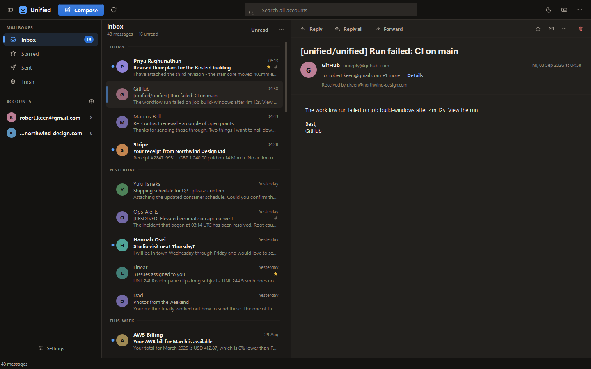

# Unified

A lightweight Windows desktop email client that combines multiple email
accounts into one inbox. Built with Python, PySide6 and SQLite - simple,
black-and-white, and fast even at 20,000+ cached messages.



## Features

- **Unified inbox** - all incoming mail from every connected account in one list,
  each row showing the owning account, sender, subject, time, unread state and
  an attachment indicator
- **Multiple accounts** - any number of Gmail accounts (OAuth2 via the Gmail
  API) plus custom IMAP/SMTP accounts
- **Full mailbox sync, verified** - the initial import paginates through the
  entire mailbox with batched, rate-limit-aware Gmail API requests. Sync is
  metadata-first (headers/flags/snippets), so even 15k-message mailboxes
  import quickly; the newest messages get bodies pre-downloaded, and the
  rest download on demand when opened. Completion is verified against the
  server message count - if anything failed, the app says so honestly
  ("15,580 / 15,644 downloaded, 64 failed, retry available") and retries on
  the next Refresh; it never reports "ready" without checking
- **Every message reachable, obviously** - the message list has a display
  limit for performance, but never hides mail silently: the status bar and
  a "Load more" button always show the true count ("Showing newest 1,000 of
  20,100 emails"), and search reaches the entire local cache regardless of
  the display limit
- **Explicit sync state machine** - each account is in exactly one state at
  a time (Connecting, Downloading message list, Syncing metadata,
  Downloading missing bodies, Verifying, Complete, Failed), shown live in
  the sidebar with real numbers, e.g. "↻ Syncing metadata 8,420/15,754" or
  "✓ Complete - 15,754/15,754 verified"
- **Parallel per-account sync** - accounts sync on independent background
  workers (2 at a time, rest queued and visibly "Waiting"); the app stays
  fully usable while syncing, and accounts can be added mid-sync
- **Race-safe email viewer** - clicking rapidly between emails never shows
  the wrong content: a stale body arriving late for a previously-selected
  email is discarded, and duplicate fetches for the same email are
  suppressed
- **Startup integrity check** - on launch, the local database is checked
  (structural integrity, duplicate message ids, orphaned rows, invalid
  folders) and auto-repaired; problems are reported, never silently ignored
  and never crash the app
- **Developer console** - a collapsible monospace log pane (Console button)
  with category filters (All / Sync / Errors / Database / API), clear,
  copy-to-clipboard, and an auto-scroll toggle
- **Background sync** - periodic synchronization on a configurable interval,
  plus manual refresh; new-mail notifications fire only for mail that arrives
  after the initial import, never for imported existing mail
- **Cancellable sign-in** - Google OAuth can be cancelled at any time
  (Cancel Login button or closing the dialog) and times out after 2 minutes;
  the main window stays fully usable while a sign-in is pending
- **Local cache** - emails are cached in SQLite so the app opens instantly and
  works offline for reading
- **Search** - full search across every account (sender, subject, body)
- **Unread counters** - total and per-account counts in the sidebar
- **Desktop notifications** - system tray notification when new mail arrives
- **Organization** - star/unstar, mark read/unread, move to trash; actions are
  pushed back to the mail server in the background
- **Compose** - send plain-text mail from any connected account
- **Security** - no passwords or tokens are ever written to disk (they live in
  the Windows Credential Manager), and the local mailbox cache itself is
  encrypted at rest - see [Security notes](#security-notes)

## Requirements

- Windows 10/11
- Python 3.10+ (for running from source; the packaged .exe needs nothing)

## Running from source

```powershell
git clone <this repo>
cd Unified
python -m venv .venv
.venv\Scripts\pip install -r requirements.txt
.venv\Scripts\python run.py
```

> Note: run `python run.py` or `python -m app.main` from the project root.
> Do not run `python app\main.py` directly - it would put `app/` on `sys.path`
> and shadow the standard library `email` module.

There is nothing to set up by hand before first launch: the app creates its
own `%APPDATA%\Unified` folder, empty database, log directory, and default
settings automatically the first time it runs. A fresh clone with no prior
install opens straight to an empty, working inbox - the only actual setup
step is the one-time Google OAuth client below, and that's only needed if
you want to add a Gmail account.

## Connecting accounts

### Gmail (OAuth2 - recommended)

Google requires each installation of an open-source desktop app to use its own
OAuth client. One-time setup:

1. Go to [Google Cloud Console](https://console.cloud.google.com/), create a
   project (any name).
2. **APIs & Services → Library** → enable the **Gmail API**.
3. **APIs & Services → OAuth consent screen** → configure (External, add your
   own address as a test user).
4. **APIs & Services → Credentials → Create credentials → OAuth client ID** →
   type **Desktop app** → download the `credentials.json`.
5. In Unified: **Settings → Select credentials.json…** and pick the file.
6. **+ Add account… → Gmail** - a browser window opens for Google sign-in.

Your Google password is never seen by the app; only the OAuth token is stored,
and only in the Windows Credential Manager. Repeat step 6 for as many Gmail
accounts as you like.

### Custom IMAP/SMTP

**+ Add account… → Custom IMAP/SMTP** and enter the server details
(IMAP over SSL, typically port 993; SMTP with STARTTLS on 587 or SSL on 465).
The password is verified against the server and then stored only in the
Windows Credential Manager. For providers with 2FA (including Gmail via IMAP),
use an app password.

## Building the .exe

```powershell
.venv\Scripts\python build.py
```

The build output is `dist\Unified\Unified.exe`. The whole `dist\Unified`
folder is the installation - copy it anywhere and run the exe. User data is
kept in `%APPDATA%\Unified`.

## Running tests

```powershell
.venv\Scripts\python -m pytest tests -v
```

## Project structure

```
Unified/
├── app/
│   ├── ui/            # PySide6 widgets: main window, dialogs, stylesheet
│   ├── database/      # SQLite storage (accounts + cached emails)
│   ├── email/         # Gmail API, IMAP, SMTP clients and MIME parsing
│   ├── auth/          # OAuth2 flow and OS-keyring secret storage
│   ├── services/      # account manager, background sync, notifications
│   ├── config.py      # paths and user settings (%APPDATA%)
│   ├── migration.py   # one-time carry-over from older installs
│   ├── logging_setup.py
│   └── main.py        # application entry point
├── assets/            # icon + screenshot for the repo/README
├── tests/             # pytest suite
├── build.py           # PyInstaller build script
├── run.py             # launcher
├── requirements.txt
└── README.md
```

## Security notes

- No plaintext credentials, ever: Gmail OAuth tokens and IMAP passwords are
  stored via [keyring](https://pypi.org/project/keyring/) in the Windows
  Credential Manager.
- Gmail access uses the official Gmail API with the `gmail.modify` and
  `gmail.send` scopes.
- IMAP connections use SSL; SMTP uses SSL or STARTTLS.
- The local SQLite cache is **encrypted at rest** (AES-256-GCM). The key is
  generated once and wrapped with Windows DPAPI - the same mechanism
  Chrome/Edge use for saved passwords - so it only unwraps under your
  specific Windows user account on this machine. The database is decrypted
  to a working copy while the app runs and re-encrypted on every clean exit.
  This protects a stolen disk, a backup that leaks, or another account on a
  shared machine; it does not protect against malware already running as
  you while the app is open, which no local password-free encryption can.
  Full detail in [RELEASE_NOTES.md](RELEASE_NOTES.md).
- Logging (the in-app Console and `logs\app.log`) never writes OAuth
  tokens, passwords, client secrets, message subjects/bodies, or attachment
  names. Account activity is logged by a local numeric ID only (e.g.
  "Account 3: sync started"), not by email address.
- Nothing under `%APPDATA%\Unified` (database, settings, encryption key) is
  ever written inside the project folder itself, and none of it is tracked
  by git - see `.gitignore`.

## What's not in this repo

This repo contains only source code, tests, and two illustrative
screenshots built from fictional demo accounts (`work@gmail.com`,
`Sarah Chen`, etc. - not real data). `.gitignore` excludes every category of
local/generated/private content: databases and encryption keys, Google
credentials and OAuth tokens, logs, Python caches (`__pycache__/`,
`.pytest_cache/`), build output (`build/`, `dist/`, `release/`, `*.spec`),
environment/local-config overrides, IDE files, and temp files. None of it
is ever written inside the project folder to begin with - see
[Security notes](#security-notes).

## Repo image

`assets/social-preview.png` (1280×640, GitHub's recommended size) is ready
to upload as this repo's social preview: **Settings → General → Social
preview → Edit → Upload an image**. It's what shows up when the repo link
is shared, e.g. on social media or in Slack.

## Note for existing installs

This project was previously named "UnifiedMailbox". On first launch, the new
build automatically copies data from the old `%APPDATA%\UnifiedMailbox`
folder (database, settings, and each account's stored sign-in) into
`%APPDATA%\Unified`, so existing accounts keep working without a re-sync or
re-login. The old folder is left untouched as a backup - delete it manually
once you've confirmed everything migrated.

## License

MIT
