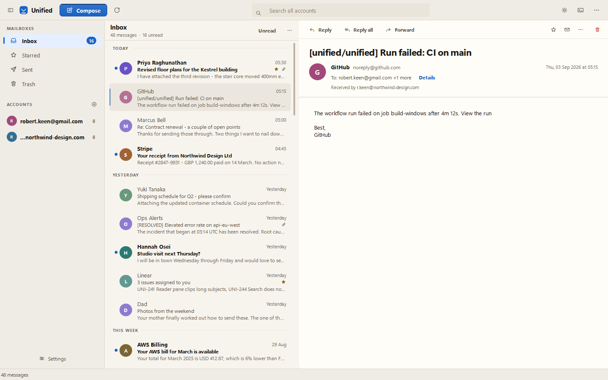

# Unified

A desktop email client for Windows that puts several accounts into one
mailbox. Gmail (via OAuth) and any IMAP/SMTP provider. Mail is cached
locally and encrypted at rest; passwords and OAuth tokens live in the
Windows Credential Manager, never in a file.

**Version 1.3.0** — a full UI/UX redesign on a new semantic design
system: a warm-ground palette with a cool accent, a light theme, an icon
set redrawn on one grid, a real motion language, keyboard-first
navigation, reply/forward, an unread filter, and a layout that adapts
down to a narrow window. See [RELEASE_NOTES.md](RELEASE_NOTES.md) for the
change log and [DESIGN.md](DESIGN.md) for the design system itself.


<details>
<summary>The same window in light mode</summary>



</details>

---

## Contents

- [Install and run](#install-and-run)
- [Setting up Gmail (Google OAuth), step by step](#setting-up-gmail-google-oauth-step-by-step)
- [Setting up an IMAP account](#setting-up-an-imap-account)
- [Using the app](#using-the-app)
- [Keyboard shortcuts](#keyboard-shortcuts)
- [Where your data lives, and how it is protected](#where-your-data-lives-and-how-it-is-protected)
- [How the code is organised](#how-the-code-is-organised)
- [Versions and dependencies](#versions-and-dependencies)
- [Building the Windows executable](#building-the-windows-executable)
- [Running the tests](#running-the-tests)
- [Troubleshooting](#troubleshooting)

---

## Install and run

### Option A — the released executable

1. Download `Unified-<version>-windows.zip` from the
   [Releases](https://github.com/preinfection/unified/releases) page.
2. Unzip it anywhere (for example `%LOCALAPPDATA%\Programs\Unified`).
3. Run `Unified.exe`.

Nothing is written next to the executable: all user data goes to
`%APPDATA%\Unified`, so the folder can be moved or deleted freely.

> Windows SmartScreen will warn about an unsigned executable the first
> time. **More info → Run anyway.** The build is unsigned because code
> signing certificates are not free; you can always build it yourself
> from source with the steps below and compare.

### Option B — from source

Requires **Python 3.11 or newer** on Windows.

```powershell
git clone https://github.com/preinfection/unified.git
cd unified

py -3.11 -m venv .venv
.\.venv\Scripts\python.exe -m pip install --upgrade pip
.\.venv\Scripts\python.exe -m pip install -r requirements.txt

.\.venv\Scripts\python.exe run.py
```

Always start it with `run.py` (or `python -m app.main`) — never
`python app/main.py`, which would put `app/` on `sys.path`, where the
`app.email` package shadows the standard library's `email` module.

---

## Setting up Gmail (Google OAuth), step by step

Unified signs in to Gmail with OAuth, so it never sees or stores your
Google password. Google requires that each installation of a desktop app
uses its **own OAuth client**, which means you create one once, in the
free Google Cloud Console, and point Unified at the file it gives you.

It takes about five minutes. You only ever do it once per machine.

> **IMAP accounts do not need any of this.** If you would rather not
> create an OAuth client, you can add Gmail as a plain IMAP account with
> an app password instead — see
> [Setting up an IMAP account](#setting-up-an-imap-account).

### Step 1 — Create a Google Cloud project

1. Go to <https://console.cloud.google.com/>.
2. Sign in with the Google account whose mail you want to read.
3. In the project dropdown at the top of the page, click
   **New Project**.
4. Name it anything (`Unified Mail` is fine), leave the organisation as
   is, and click **Create**.
5. Wait for the notification, then make sure the new project is the one
   selected in the top bar.

### Step 2 — Enable the Gmail API

1. In the left menu choose **APIs & Services → Library**
   (or go to <https://console.cloud.google.com/apis/library>).
2. Search for **Gmail API**.
3. Open it and click **Enable**.

If you skip this step, sign-in appears to succeed and then every sync
fails with a "Gmail API has not been used in project …" error.

### Step 3 — Configure the OAuth consent screen

1. Go to **APIs & Services → OAuth consent screen**.
2. Choose **External** and click **Create**.
   (**Internal** is only available on Google Workspace accounts; pick it
   if you have one and only your organisation will use the app.)
3. Fill in the required fields:
   - **App name** — `Unified`
   - **User support email** — your own address
   - **Developer contact information** — your own address

   Everything else can be left blank. Click **Save and continue**.
4. On the **Scopes** page you can click **Save and continue** without
   adding anything. Unified requests its scopes at sign-in time:
   - `https://www.googleapis.com/auth/gmail.modify` — read mail and
     change read/starred flags
   - `https://www.googleapis.com/auth/gmail.send` — send mail

   (If you prefer to declare them here, use **Add or remove scopes** and
   paste those two.)
5. On the **Test users** page, click **+ Add users** and add **your own
   Gmail address**, then **Save and continue**.

   > This step is the one people miss. While the app is in *Testing*
   > status — which is where it stays unless you submit it to Google for
   > verification — **only addresses listed here can sign in.** Any other
   > account gets "Access blocked: Unified has not completed the Google
   > verification process".

6. Review and go back to the dashboard.

> **About the "unverified app" warning.** Because this OAuth client is
> yours and unverified, Google shows a warning screen during sign-in.
> Click **Advanced → Go to Unified (unsafe)**. It says "unsafe" because
> Google has not reviewed the app — you are granting access to an
> application running on your own machine, from your own OAuth client.
> Tokens in *Testing* status also expire after **7 days**, after which
> you simply sign in again; publishing the app (below) removes that.

### Step 4 — Create the OAuth client and download credentials.json

1. Go to **APIs & Services → Credentials**.
2. Click **+ Create credentials → OAuth client ID**.
3. **Application type: `Desktop app`.** This matters — Unified receives
   the sign-in redirect on a temporary `http://localhost:<random port>/`
   server, which only a Desktop-app client is allowed to do. A "Web
   application" client will fail with `redirect_uri_mismatch`.
4. Name it `Unified` and click **Create**.
5. In the dialog that appears, click **Download JSON**. You will get a
   file called something like
   `client_secret_1234567890-abcdefg.apps.googleusercontent.com.json`.

Keep that file somewhere you can find it. It is not a password — it
identifies your OAuth client — but treat it as private anyway, and never
commit it to a repository.

### Step 5 — Point Unified at the file

1. Start Unified.
2. Open **Settings** (bottom of the sidebar, or `Ctrl+,`).
3. Go to **Mail → Google sign-in**.
4. Click **Choose credentials.json…** and select the file you
   downloaded.

Unified copies it to `%APPDATA%\Unified\google_credentials.json`. The
panel changes to "An OAuth client is configured. You can add Gmail
accounts."

### Step 6 — Add your Gmail account

1. Click **+** beside **ACCOUNTS** in the sidebar (or `Ctrl+Shift+A`).
2. Choose **Gmail**, then **Continue with Google**.
3. Your browser opens. Pick the account, work through the unverified-app
   warning if it appears, and grant access.
4. The tab shows "Sign-in complete"; Unified closes the local server and
   starts syncing straight away.

The refresh token is stored in the **Windows Credential Manager** under
the service `Unified`, never in a file. Removing the account from
Settings deletes it.

### Optional — publishing the app to stop the 7-day token expiry

While the consent screen is in *Testing*, refresh tokens expire after 7
days and you have to sign in again. To stop that:

1. **APIs & Services → OAuth consent screen → Publish app**.
2. Confirm. Status becomes **In production**.

Google only requires a verification review if you distribute the client
to other people; for a personal client used by its own owner, publishing
is enough and the unverified warning stays but the token stops expiring.

---

## Setting up an IMAP account

Works with any provider that offers IMAP and SMTP — Fastmail, Proton
Bridge, Outlook, a self-hosted server, or Gmail itself.

1. Click **+** beside **ACCOUNTS** (or `Ctrl+Shift+A`).
2. Choose **Other mailbox (IMAP)**.
3. Enter your email address, password, and IMAP server. Open **Server
   settings** if you need to change the ports or the SMTP host — by
   default Unified uses IMAP `993` (SSL), SMTP `587` (STARTTLS), and
   guesses the SMTP host from the IMAP one.
4. Click **Add account.** The credentials are verified against the server
   before anything is saved, so a typo fails immediately rather than
   silently later.

Common settings:

| Provider | IMAP server | Port | SMTP server | Port |
|---|---|---|---|---|
| Gmail | `imap.gmail.com` | 993 | `smtp.gmail.com` | 587 |
| Outlook / Hotmail | `outlook.office365.com` | 993 | `smtp-mail.outlook.com` | 587 |
| Fastmail | `imap.fastmail.com` | 993 | `smtp.fastmail.com` | 587 |
| Yahoo | `imap.mail.yahoo.com` | 993 | `smtp.mail.yahoo.com` | 587 |

> **Use an app password, not your account password**, for any provider
> with two-factor authentication. Gmail: <https://myaccount.google.com/apppasswords>
> (requires 2-Step Verification enabled first). Outlook and Yahoo have
> equivalent pages. The password is stored in the Windows Credential
> Manager.

---

## Using the app

The window is three panes under one command bar:

- **Sidebar** — mailboxes (Inbox, Starred, Sent, Trash) and your
  connected accounts. An account is a *filter* on the mailbox you are
  in, not a place of its own: click it to scope the current view to that
  address, click it again to clear the filter.
- **Message list** — its header always states where you are, what it is
  filtered to and how many messages there are. Dates group the list
  (Today / Yesterday / This week / …). The **Unread** button filters to
  unread only.
- **Reading pane** — subject, sender, recipients, attachments and the
  message, with Reply / Reply all / Forward on the left of its action
  row and Delete separated on the right.

Other things worth knowing:

- **Appearance** follows Windows light/dark by default. Change it from
  the moon/sun button in the command bar or in Settings → Appearance.
  Switching is live: the palette, the Qt palette and the stylesheet all
  move together, so nothing needs a restart.
- **Motion** conveys state, never decoration: nothing loops, nothing
  animates on load, and nothing takes longer than 350ms. It is a setting
  under **Settings → Appearance → Motion** — *Full* (the default), *Match
  Windows*, or *Reduced*. The two quieter options drop movement (slides,
  travel, rises) but keep the in-place feedback that makes controls feel
  responsive.
- **List density** (Compact / Cozy / Relaxed) is in the list's ⋯ menu and
  in Settings → Appearance.
- **Remote images are blocked** until you ask for them, per message — a
  banner in the reading pane says so and offers "Show images". This stops
  tracking pixels from confirming that you opened the mail.
- **Search** looks in the local cache instantly, then asks each provider
  to search its own server for anything that was never cached. It is
  scoped to whatever the list is showing.
- **Paging** is served from the cache; only when the cached messages run
  out does Unified fetch an older batch from the server.
- Narrow the window and the sidebar collapses to an icon rail; narrow it
  further and the reading pane takes over the list's space with a Back
  button.

---

## Keyboard shortcuts

| Key | Action |
|---|---|
| `Ctrl+N` | New message |
| `Ctrl+F` or `/` | Focus search |
| `Esc` | Clear search / back to the list |
| `F5` or `Ctrl+R` | Sync all accounts |
| `Ctrl+1` … `Ctrl+4` | Inbox / Starred / Sent / Trash |
| `Ctrl+B` | Show or hide the sidebar |
| `Ctrl+,` | Settings |
| `Ctrl+Shift+A` | Add an account |
| `Ctrl+` `` ` `` | Developer console |
| `J` / `K` or `↓` / `↑` | Next / previous message |
| `Enter` | Open the selected message |
| `R` / `Shift+R` / `F` | Reply / Reply all / Forward |
| `S` | Star or unstar |
| `U` | Mark read or unread |
| `Del` | Move to Trash |
| `Ctrl+Enter` | Send (in the compose window) |

---

## Where your data lives, and how it is protected

Everything is under `%APPDATA%\Unified`:

| Path | What it is |
|---|---|
| `mailbox.db` | The local message cache (SQLite), while the app is running |
| `mailbox.db.enc` | The same cache, AES-256-GCM encrypted, while it is not |
| `key.bin` | The 32-byte cache key, wrapped with Windows DPAPI |
| `settings.json` | Sync interval, notifications, appearance, density |
| `google_credentials.json` | Your OAuth client file, if you configured one |
| `logs\` | Rotating application logs |

**Encryption at rest.** On a clean shutdown the cache is encrypted to
`mailbox.db.enc` and the plaintext file is securely deleted; on startup
it is decrypted back. The key in `key.bin` is wrapped with DPAPI, which
only unwraps under the same Windows user account on the same machine —
copying the folder to another PC yields an unreadable cache, and Unified
says so rather than silently starting empty.

**Credentials** are never written to disk by Unified. Gmail refresh
tokens and IMAP passwords go to the Windows Credential Manager under the
service name `Unified`.

**Attachments** are never cached — only their metadata, which is passed
through a guard that flags or blocks dangerous file types, and the
sanitized name is what the UI shows.

**Links** in a message are opened only if their scheme is on an allowlist.
`file://` and UNC paths are refused: a mail client that hands every
anchor to `ShellExecute` will happily launch an attacker's `.exe` or leak
an NTLM hash to a remote SMB share.

---

## How the code is organised

```
run.py                  launcher (keeps app/ off sys.path)
build.py                PyInstaller build + multi-size .ico generation
installer/Unified.iss   Inno Setup script for the installer

app/
  main.py               entry point; startup sequence and window wiring
  config.py             %APPDATA% paths and the JSON settings store
  logging_setup.py      rotating file + console logging
  migration.py          one-time migration from the pre-rename install

  auth/
    gmail_oauth.py      cancellable OAuth flow with a localhost redirect
    secrets_store.py    Windows Credential Manager wrapper

  database/db.py        SQLite schema, queries, integrity check and repair

  email/
    gmail_client.py     Gmail API: list, fetch, send, flags
    imap_client.py      IMAP: list, fetch, send-copy, flags
    smtp_client.py      SMTP sending
    message_parser.py   MIME parsing, snippets, attachment metadata

  security/
    crypto_store.py     AES-256-GCM cache encryption, DPAPI-wrapped key
    attachment_guard.py dangerous-attachment classification

  services/
    sync_service.py     threaded sync manager, workers and progress model
    account_manager.py  add / verify / remove accounts
    notifier.py         tray notifications

  ui/
    main_window.py      the shell: panes, scope state, shortcuts, wiring
    compose_dialog.py   compose / reply / forward
    settings_dialog.py  settings
    account_dialog.py   add an account
    startup_window.py   the splash shown while the cache decrypts
    console.py          developer log console
    html_view.py        the HTML mail renderer (sanitizing, image policy)
    icons.py            the programmatically drawn app icon and mark
    svg_icon.py         SVG loading, tinting and caching
    theme.py            design-token facade (what widgets import as `t`)
    style.py            get_stylesheet()

    design/             the design system - see DESIGN.md
      tokens.py         spacing, radii, type, motion, geometry
      palette.py        semantic color roles + light and dark palettes
      theme.py          ThemeManager: palette, density, reduced motion
      stylesheet.py     the single application QSS

    components/         the component library
      buttons, dialog, badge, avatar, dropdown, search_field, toggle,
      focus, states, toast, nav_pill, sidebar, account_item,
      command_bar, list_header, email_list, reader, section_header

tests/                  250 tests (pytest, headless via QT_QPA_PLATFORM)
assets/icons/           the SVG icon set
```

The three pieces worth reading first: `app/ui/design/palette.py` (what
the colors mean), `app/ui/main_window.py` (how the shell is wired), and
`app/services/sync_service.py` (how mail actually arrives).

---

## Versions and dependencies

| | |
|---|---|
| Python | **3.11+** (built and tested on 3.11) |
| Platform | Windows 10 / 11 (DPAPI, Credential Manager and the dark title bar are Windows APIs) |
| Unified | **1.3.0** |

From `requirements.txt`:

| Package | Minimum | Used for |
|---|---|---|
| `PySide6` | 6.6 (tested on 6.11.2) | The Qt 6 UI |
| `google-api-python-client` | 2.100 | Gmail API |
| `google-auth` | 2.23 | Google credentials |
| `google-auth-oauthlib` | 1.1 | The OAuth installed-app flow |
| `keyring` | 24.0 | Windows Credential Manager |
| `cryptography` | 41.0 | AES-256-GCM cache encryption |
| `pywin32` | 305 | DPAPI key wrapping |
| `pyinstaller` | 6.0 | Building the executable |
| `pytest` | 7.4 | Tests |
| `Pillow` | 10.0 | `build.py` only — assembles the multi-size `.ico` |

---

## Building the Windows executable

From the project root, inside the virtual environment:

```powershell
.\.venv\Scripts\python.exe build.py
```

This does two things:

1. Renders the app icon at every size Windows asks for (16 … 256px), each
   drawn at its own resolution rather than scaled down, and assembles
   them into a real multi-size `assets/icon.ico`.
2. Runs PyInstaller in one-folder, windowed mode.

Output: **`dist/Unified/Unified.exe`**, with its dependencies in
`dist/Unified/_internal/`. Ship the whole `dist/Unified` folder — the
`.exe` alone will not run.

The build explicitly bundles a few things PyInstaller cannot see by
itself: the SVG icon assets (`assets/icons`), Google's bundled API
discovery documents, `keyring`'s Windows backend, and the DPAPI modules
(`win32crypt`, `win32timezone`). Without them the app builds and then
crashes on first paint or first sign-in.

To build the installer as well, install
[Inno Setup 6](https://jrsoftware.org/isdl.php) and compile
`installer/Unified.iss` — it produces
`Unified-Setup-v<version>.exe`, which installs per-user into
`%LOCALAPPDATA%\Programs\Unified` and leaves `%APPDATA%\Unified`
untouched on uninstall.

---

## Running the tests

```powershell
.\.venv\Scripts\python.exe -m pytest -q
```

250 tests, all headless — they set `QT_QPA_PLATFORM=offscreen`
themselves, so no display is needed. They cover the sync manager,
database integrity and migration, the crypto store, the attachment
guard, HTML rendering and sanitizing, and the design system (token
contracts, WCAG contrast in both themes, and real rendered pixels for
the components).

Two development helpers live in `.design-research/` (git-ignored):
`shots.py` renders the whole app against seeded mail in both themes and
at three widths, and `gallery.py` renders every control in every state.
Both are how the redesign was reviewed.

---

## Troubleshooting

**"Access blocked: Unified has not completed the Google verification
process"** — your address is not in the OAuth consent screen's **Test
users** list. Add it (Step 3.5 above) and try again.

**`redirect_uri_mismatch`** — the OAuth client is not of type
**Desktop app**. Create a new one with the right type and select the new
`credentials.json` in Settings.

**"Gmail API has not been used in project … before or it is disabled"** —
Step 2 was skipped. Enable the Gmail API and wait a minute.

**Gmail sign-in stops working after about a week** — the consent screen
is still in *Testing*, where refresh tokens expire after 7 days. Either
sign in again, or publish the app (see the end of the OAuth section).

**IMAP login fails with the right password** — the provider requires an
app password, or IMAP access is switched off in its web settings.

**"Your encrypted mailbox could not be unlocked"** — the cache was
encrypted by a different Windows user or on a different machine, and
DPAPI will not unwrap the key. Nothing was deleted: the encrypted file is
kept as it was. Remove and re-add your accounts to rebuild the cache, or
restore the original `key.bin`.

**The window opens blank or unstyled** — check
`%APPDATA%\Unified\logs\` and the in-app console (`Ctrl+` `` ` ``).

**Sync says "completed with issues"** — some messages failed to
download; press Refresh to retry just those. The count is shown in the
account's status line in the sidebar.

---

## Credits

The design system is documented in [DESIGN.md](DESIGN.md). Two parts of
it are ported rather than invented:

- The motion scale (durations, easings, distances, scales, blur) and the
  per-transition behaviour are [transitions.dev](https://transitions.dev)
  by Jakub Antalik, implemented natively in Qt.
- The interaction rules behind it — respond on press, animate from the
  presentation value, interruptibility, spatial consistency,
  size-specific tracking — come from Apple's *Designing Fluid Interfaces*
  and *The Details of UI Typography*, by way of Emil Kowalski's
  `apple-design` skill.

## License

See the repository for license information.
